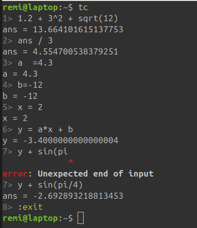

# Terminal calculator

A simple command line calculator.

## Purpose

The binary name is `tc`.
If you are already in a terminal session and need a quick calculation,
typing `tc "2.5 + 3.73 / 4"` is actually faster than grabbing
your desktop calculator or starting and using a calculator app.

`tc` is also **a lot simpler** to use than `bc` or `dc`.

## Manual

The [manual](./doc/Manual.adoc) states quite everything you need to know about `tc`.
(and it'll take you about one minute to read)

## Examples

### Expressions on the command line

```sh
$ tc "1.2 + 3^2 + sqrt(12)"
1.2 + 3^2 + sqrt(12) = 13.664101615137753

$ tc "cos(pi/3)" "sin(pi/6)"
cos(pi/3) = 0.5000000000000001
sin(pi/6) = 0.49999999999999994

$ tc -s "12*3 + 18*2.5 - 3 * 2.3" # or --strip
74.1
```

### Interactive session



### Clear diagnostics

```sh
$ tc "1.4 + son(pi/6)" # typo
1.4 + son(pi/6)
      ^^^
error: Function `son` is unknown
```

## Grammar reference

See [Grammar.ebnf](./doc/Grammar.ebnf)


## Installation

Several methods are supported. If you are a rust developer, you can use `cargo` directly:

```sh
$ cargo install termcalc
```

This will install the program `tc` on all supported platforms.

_Other methods: work in progress_

### Linux specific case

On Linux, `tc` is a kernel system utility (Traffic Control).
So other methods than `cargo` will install a binary named `termcalc`.
If you don't use the system `tc`, you are encouraged to create
a `tc` alias to `termcalc` like so:

```sh
$ echo "alias tc=termcalc" >> ~/.bash_aliases
$ source ~/.bashrc
```

If it doesn't work, uncomment or append the following to `~/.bashrc`

```sh
if [ -f ~/.bash_aliases ]; then
    . ~/.bash_aliases
fi
```
